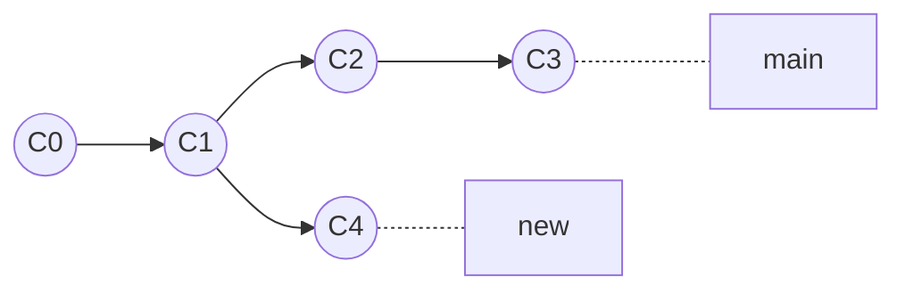
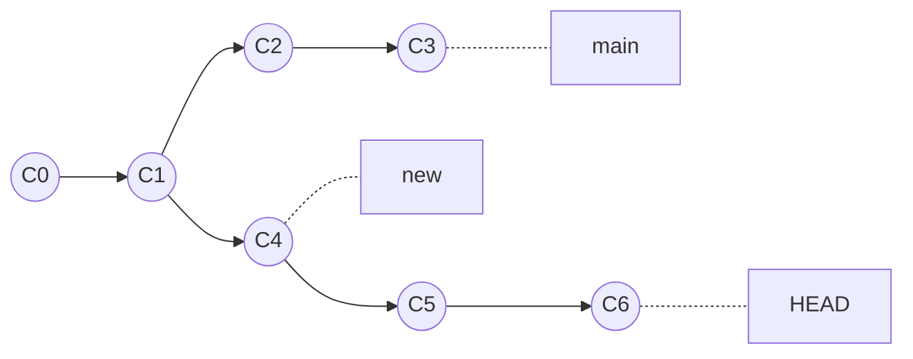
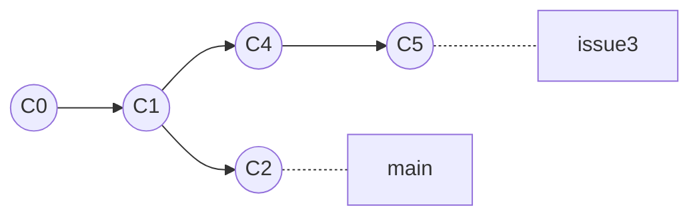
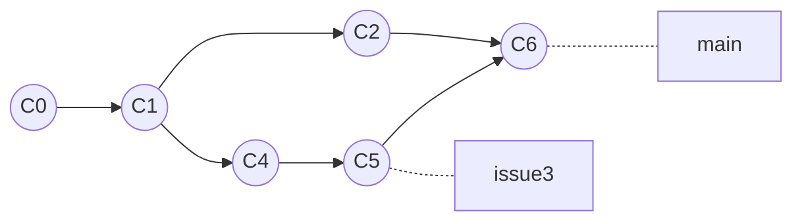
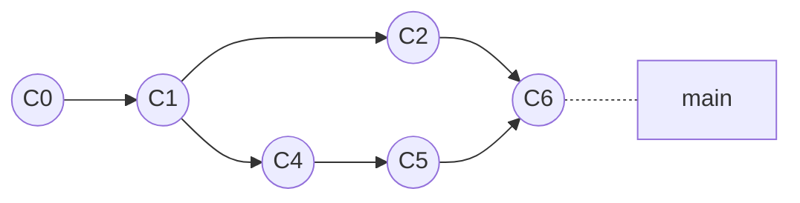

# ~~WTF~~ FTW

~~***W***hat ***t***he ***f***??k~~ ***F***un ***T***o ***W***atch

## How to setup git and SSH key

These setups are useful not only for cloning this repo, but also for submitting your own work to the git server, so probably you should follow these steps.

P.S. For WSL you should follow the steps for Linux users instead of Windows, and check your Linux distro. The following steps are for Ubuntu/Debian users.

First, [install git](https://github.com/git-guides/install-git) on your local machine.

```bash
$ sudo apt-get update
$ sudo apt-get install git-all
```

Then, install openSSH through:

```bash
$ sudo apt update
$ sudo apt install openssh-client
```

 refer to: [generate SSH key](https://docs.github.com/en/authentication/connecting-to-github-with-ssh/generating-a-new-ssh-key-and-adding-it-to-the-ssh-agent?platform=windows) and [add SSH key to github](https://docs.github.com/en/authentication/connecting-to-github-with-ssh/adding-a-new-ssh-key-to-your-github-account).

Open a terminal, an then run these two commands with your own username and own email adddress.

```bash
git config --global user.name "your real name in pinyin"
git config --global user.email "<your jaccount>@sjtu.edu.cn"
```

Generally you will not encounter any problems if you follow the instructions on the website, but if you do, you can refer to the following steps, which is a clone of the guide on setting up.


<details close>
    <summary>Setting Up SSH</summary>

## Secure Shell

Using the Secure Shell (SSH) protocol, you can connect and authenticate to remote servers and services. With SSH keys, you can connect to git server easily and securely. This tutorial will help you generate your own SSH key. To learn more about SSH authentication, refer to [About SSH](https://help.github.com/en/github/authenticating-to-github/about-ssh).

### Step 1: Preparation

<details close>
    <summary>WSL / Debian / Ubuntu</summary>

In your terminal, install `openssh` using your package manager. For example, in Debian / Ubuntu, type

```bash
$ sudo apt update
$ sudo apt install openssh-client
```

If you are using WSL, and also want to config the SSH directly in Windows, refer to the Further Readings.

</details>

<details close>
    <summary>Ach Linux / Manjaro</summary>

```bash
$ sudo pacman -Syyu
$ sudo pacman -S openssh
```

</details>

<details close>
    <summary>macOS</summary>

```bash
$ brew install openssh
```
</details>

### Step 2: Check for existing SSH keys

Open your terminal (macOS/Linux) or git bash (Windows) and type

```bash
$ ls -al ~/.ssh
```

Check whether you already have `id_rsa` and `id_rsa.pub`.

1. If these files exist, go to step 4.
2. If `.ssh` directory does not exist, or it’s empty. For example, if the output is

```bash
ls: cannot access '.ssh': No such file or directory
```

### Step 3: Generate a new SSH key

See [this tutorial](https://docs.github.com/en/authentication/connecting-to-github-with-ssh/generating-a-new-ssh-key-and-adding-it-to-the-ssh-agent#generating-a-new-ssh-key) to create a new keypair. Remember to use your SJTU email ("\<your jaccount\>@sjtu.edu.cn").

Usually, you can just press Enter to leave the passphrase empty.

### Step 4: Check and submit

In your terminal (macOS/Linux) or git bash (Windows), check whether the key is already generated by typing

```bash
$ cd ~/.ssh
$ ls -al
```

You should be able to find `id_ed25519` and `id_ed25519.pub`. Open the file `id_ed25519.pub` in a text editor, or type `cat id_ed25519.pub` in the terminal.

Then open ^^^ in your browser. Press the button on the top right corner, then go to "Settings". Go to "SSH / GPG Keys". 

In the SSH Key section, press "Add Key". Paste the content your `id_rsa.pub` file in the box below. If you succeed, the Key name will be generated automatically. You should copy and paste something in the form:
```
ssh-ed25519 <some very long thing> <your jaccount>@sjtu.edu.cn
```

Then press "Add Key". The system will display a green success banner.

**Important: only copy the public key, i.e. the key with `.pub` suffix.**

### Further readings

In most cases this section can be skipped. Refer to it in case you meet problems and contact a manager.

<details close>
    <summary>Windows 10</summary>

You can also generate SSH keys with Git Bash, first install [git for windows](https://gitforwindows.org/).

If you’ve already installed `git` with `choco`, you can skip this step.

Then you can open the Git Bash to perform the same procedures, the home directory `~` will be `C:\Users\Username`.

You can also copy the `~/.ssh` folder in WSL into `C:\Users\Username\.ssh` so that everything will work on git bash without any other configuration.

</details>

<details close>
    <summary>SSH server in WSL</summary>

The default SSH Server may not be configured correctly in WSL. You can check it by

```bash
$ sudo service ssh stop
$ sudo /usr/sbin/sshd -d
```

Check the startup logs and make sure HostKeys are available and you don’t see log messages such as:

```
debug1: sshd version OpenSSH_7.2, OpenSSL 1.0.2g  1 Mar 2016
debug1: key_load_private: incorrect passphrase supplied to decrypt private key
debug1: key_load_public: No such file or directory
Could not load host key: /etc/ssh/ssh_host_rsa_key
debug1: key_load_private: No such file or directory
debug1: key_load_public: No such file or directory
Could not load host key: /etc/ssh/ssh_host_dsa_key
debug1: key_load_private: No such file or directory
debug1: key_load_public: No such file or directory
Could not load host key: /etc/ssh/ssh_host_ecdsa_key
debug1: key_load_private: No such file or directory
debug1: key_load_public: No such file or directory
Could not load host key: /etc/ssh/ssh_host_ed25519_key
```

If you do see such messages and the keys are missing under /etc/ssh/, you will have to regenerate the keys or just purge & install `openssh-server`:

```bash
$ sudo apt purge openssh-server
$ sudo apt install openssh-server
```

You may also need to configure the ssh server in `/etc/ssh/sshd_config` with `vi` or `nano` (use `sudo` for root privilege).

Find the lines

```
PermitRootLogin no/prohibit-password
PasswordAuthentication no
```

Change them to

```
PermitRootLogin yes
PasswordAuthentication yes
```

Remember to remove # if it exists in any of the two lines.

This will enable root login and password login which is usually useful.

Then

```bash
$ sudo service ssh restart
$ sudo service ssh status
```

If you want to login with root by password, you need to set a password first:

```bash
$ sudo passwd root
```

You should now be able to connect to WSL on your Git Bash:

```bash
$ ssh root@localhost
```

</details>

### References

1. [Connecting to GitHub with SSH](https://help.github.com/en/github/authenticating-to-github/connecting-to-github-with-ssh)
2. [Open SSH Service in WSL](https://blog.csdn.net/zhouzme/article/details/81087837)
3. [WSL Troubleshooting](https://docs.microsoft.com/en-us/windows/wsl/troubleshooting)
</details>

<details close>
    <summary>Git setup</summary>


## Git installation and setup

For information about git, please refer to Introduction to git.

### Installation

<details close>
    <summary>WSL / Debian / Ubuntu</summary>

Reference in https://www.git-scm.com/download/linux

```bash
$ sudo apt install git
```
</details>

<details close>
    <summary>Arch Linux / Manjaro</summary>

```bash
$ sudo pacman -Syyu git
```
</details>

<details close>
    <summary>macOS</summary>

Using [homebrew](https://brew.sh/)

If `brew` is not installed in your mac yet, follow the guide on the homebrew website.

Open the terminal.

```bash
$ brew install git
```
</details>

Type `git --version` after installation, if it returns a version number, then it is done.

### Configuration

First, open a terminal, an then run these two commands with your own username and own email adddress.

**Important: input your real name in pinyin and use your sjtu email address**

```bash
git config --global user.name "your real name in pinyin"
git config --global user.email "<your jaccount>@sjtu.edu.cn"
```

### Further readings

In most cases this section can be skipped. Refer to it in case you meet problems and contact a manager.

<details close>
    <summary>Git GUI</summary>

Most modern IDE integerate git either natively or through plugins. Common examples are VSCode, Atom, Vim/Neovim (plugins), and JetBrains. 

</details>

### References

1. [Learn Git branch](https://learngitbranching.js.org/)
2. [Git book](https://git-scm.com/book/en/v2/Git-Basics-Getting-a-Git-Repository)
</details>


<details close>
    <summary>SSH server in WSL</summary>

The default SSH Server may not be configured correctly in WSL. You can check it by

```bash
$ sudo service ssh stop
$ sudo /usr/sbin/sshd -d
```

Check the startup logs and make sure HostKeys are available and you don’t see log messages such as:

```
debug1: sshd version OpenSSH_7.2, OpenSSL 1.0.2g  1 Mar 2016
debug1: key_load_private: incorrect passphrase supplied to decrypt private key
debug1: key_load_public: No such file or directory
Could not load host key: /etc/ssh/ssh_host_rsa_key
debug1: key_load_private: No such file or directory
debug1: key_load_public: No such file or directory
Could not load host key: /etc/ssh/ssh_host_dsa_key
debug1: key_load_private: No such file or directory
debug1: key_load_public: No such file or directory
Could not load host key: /etc/ssh/ssh_host_ecdsa_key
debug1: key_load_private: No such file or directory
debug1: key_load_public: No such file or directory
Could not load host key: /etc/ssh/ssh_host_ed25519_key
```

If you do see such messages and the keys are missing under /etc/ssh/, you will have to regenerate the keys or just purge & install `openssh-server`:

```bash
$ sudo apt purge openssh-server
$ sudo apt install openssh-server
```

You may also need to configure the ssh server in `/etc/ssh/sshd_config` with `vi` or `nano` (use `sudo` for root privilege).

Find the lines

```
PermitRootLogin no/prohibit-password
PasswordAuthentication no
```

Change them to

```
PermitRootLogin yes
PasswordAuthentication yes
```

Remember to remove # if it exists in any of the two lines.

This will enable root login and password login which is usually useful.

Then

```bash
$ sudo service ssh restart
$ sudo service ssh status
```

If you want to login with root by password, you need to set a password first:

```bash
$ sudo passwd root
```

You should now be able to connect to WSL on your Git Bash:

```bash
$ ssh root@localhost
```
</details>

## How to Clone Locally and use Git properly

change to the directory you want to clone the repo to, and then run the following command:

```bash
$ git clone git@github.com:Frank0415/FTW.git
```

You can play this game [Learn Git branching](https://learngitbranching.js.org), and you will learn more than the basics in one hour.

Naming conventions:
[Commit naming conventions](https://www.conventionalcommits.org/en/v1.0.0/)
[Branching Conventions](https://medium.com/@abhay.pixolo/naming-conventions-for-git-branches-a-cheatsheet-8549feca2534)

<details close>
    <summary>Intro to Git</summary>

# Introduction to Git

## What is Git

A version control system.

- Keep track of your project.
- Easy to access historical versions.
- Parallel workflow with branches.

## Why Git

Think about these scenarios:

1. You accidentally deleted part of your source code.
2. You and your colleague are working in parallel on different features of the same project.
3. You tried out a brand new idea, but it’s actually a bad idea and you want an “undo”.

As you start coding, you’ll find these demands reasonable, and all of them can be covered by Git. We’ll see how to deal with them later.

## Git Repository

Suppose you have a project that is managed by Git. The main folder containing all your project files is called a Git `Repository`, or `repo` for short. To start working with Git, go inside your project folder and perform:

```bash
cd my-project/   # go inside the project folder
git init         # initialize
```

In this way you’ve created a new local `repo`.

However, your target `repo` could be remote, e.g. on GitHub, and you have to download it. Perform

```bash
git clone <url> [local name]
```

and the `repo` will show up in your folder.

Here `<term>` means you should replace `<term>` with what it means, and `[term]` means it’s optional.

## Git Commit

Git saves your work bit by bit using `commit`. A `commit` contains a `patch` and a commit message. A `patch` can be understood as “the additional work done since last `commit`”, while the commit message summarizes what work was done exactly. Note that the `commit`s can be cascaded, together they can represent how your work adds up.

For _Scenario 1_, Git works by creating a `.git` folder in your project. As long as you committed the work and didn’t delete `.git` folder, your history is recoverable.

To commit, you have to follow two steps:

1. `git add <files>` which selects what will be committed this time
2. `git commit -m <message>` which performs the commit and adds the message

Note that:

1. `<files>` could be `*` if you just want everything to be included.
2. `<message>` can be quoted like `git commit -m “I did this.”`, which generates the message “I did this.”.

### Commit is not Save - Make Commits Meaningful

Now you may have the impression that a commit saves your work. That’s true, but it’s very different from pressing `Ctrl+S` / `Cmd+S`. A commit must be meaningful overall. You have to tell the reader (your colleague or your future self) what is done in this commit.

- commits should be atomic (small, doing only one thing, e.g. belong to only 1 feature or fix)
- it should not prevent your game from compiling
- the commit message should be only a few words but describe everything you did (if you can't do that, then you're doing too much in this commit)

Following these guidelines will make it easier to find the commit in which a bug was introduced, and also find the problematic change in that commit quickly.

If you did too much and can’t tell what specific task you’ve done in a commit, then it should be separated into several commits by

```bash
git add a.elm
git commit -m "Did a." # perhaps making the snake moving
git add b.elm
git commit -m "Did b." # perhaps deciding the endgame condition
```

An advanced usage is you can `add` not the whole file, but only a part of it, by

```bash
git add a.elm -p
```

and follow the instructions to select only some of the lines in a file.

## Git Push & Pull

We won't go into details about these two commands.

Basically, `git pull` will download the new commits from the Gitea server, which includes the code that your collaborators recently wrote. So, you need to run this command when you start your coding every day.

`git push` is command that can upload your commits to the Gitea server, so that your collaborators can pull it.

## Git Branch

Now that we’ve got many `commits`, how can we manage these commits? Git creates the concept `branch`. A `branch` is a string of `commit`s in a certain order. As your project continues receiving `commit`s, it’s `branch` gets longer. You can create a new `branch` at any commit. **Every branch has a `head` indicating where the next commit will be applied.**



In this example, you start from `C0` at branch `main` and commits `C1` - `C3` step by step. Then you have a new idea and creates a new branch at `C1` called `new`, and commits `C4`. The head of branch `main` points to `C3`, and the head of `new` points to `C4`.

You can imagine `branch` as the “branch” in the parallel universe theory. Every time we make a binary decision, the universe divides into two branches indicating two possibilities. The `head` of a `branch` points to the latest moment, ensuring that time grows linearly - your path is set on a certain branch, but your current alteration may change the future.

The final piece of this system is `HEAD`, which is similar to the `head` of a branch, but it indicates where your _current_ location is. In the example above, your `HEAD` now points to branch `new`, meaning you’re at branch `new`. `HEAD` is just like “your working directory in git”.

To change your `HEAD`, use

```bash
git checkout <branch/commit>
```

which travels in Git history and revert your project to a certain time point (commit).

To create a new `branch` at current `commit`, use

```bash
git branch <name>
```

More usage can be found by `git branch --help` (so does all other `git <subcommand> --help`).

Now we can try to solve the scenarios.

For _Scenario 2_, you and your colleague are working together, perhaps even changing the same file. Suppose you are using `main` in the example above. Your colleague can checkout `C1`, create a branch called `new`, and commit his `C4`.

For _Scenario 3_, you did some bad experiments and find it hard to correctly delete all your wrong codes, you can reset your branch to any one of your previous commits using

```bash
git reset <commit> [option]
```

Here you have three options. Go check the manual use `--help` and find out how they work.

**!!!** `git reset` could be dangerous because it may erase all the commits after your reset point.

### Conservative Head Rule

It turns out that `branch` is _the_ most important concept in Git. We claim that the following rule always holds for commits:

If a commit can be found in any one of the heads, it should be kept; however if no branch or head contains the commit, the commit will be discarded.

This rule is called the Conservative Head Rule. (Don’t try to search it, I made it myself.)



For example, with the previous example given, one can use these commands to get the result above:

```bash
git checkout C4       # "detached head state"
git commit -m "..."   # the commit is represented as C5
git commit -m "..."   # the commit is represented as C6
```

Now, if one run `git checkout main` (or any other destination), both `C5` and `C6` will be lost, because as our `HEAD` has been changed to point `main`, these commits aren’t in any branch. This state is called `detached head state` because the `HEAD` is not pointing to any branch, and will bring such risk of losing commits. To keep `C5` and `C6`, one should immediately create a branch at `HEAD`.

## Git Merge and Pull Request

In a real development, we always place our major development flow on the `master` branch, (sometimes called `main` branch).

For example, look at the following tree graph.



In this repo, suppose that your customer has reported a bug tagged `#issue3` and you are the programmer in charge of it. Right now, after a few commits, you are pretty sure that you have fixed the bug. You need to put your work onto the `main` branch, so that when the company release the product next time, your customers will not have to suffer the previous problems.

What you should do is:

```bash
git checkout main #to make sure that you are on the main branch
git merge issue3 #Merge the changes you made to the main branch
```

After running these commands, your tree will look like this:



Now that your work is merged in, you have no further need for the `issue3` branch. You can close the issue in your issue-tracking system, and delete the branch:

```bash
git branch -d issue3
```

Your tree will then look like this:



### **But, this might not always work!**

Please look at the original graph:


### What will happen if `C5` changed the same code block with `C2`?

In this case, the git system will not create the merged result: `C6` commit immediately. The system will ask you to handle the conflicts by hand. Git will modify your files so that they look like this:

```html
<<<<<<< HEAD:index.html
<div id="footer">contact : email.support@github.com</div>
=======
<div id="footer">please contact us at support@github.com</div>
>>>>>>> issue3:index.html
```

You can use the tools provided in WebStorm or VSCode to do the merging and solve the conflicts. After that, you can use `git commit` to finalize your merge.

Then, your repo tree will look again like this:


## Git Stash
**Warning: The situations where Git Stash Commands can be used are strictly limited. Misusing Git Stash Commands brings serious risk of losing your code.**

In team development, it is efficient to work in different branches. But sometimes when you are dealing with some work on one branch, you have to switch to another branch to work on something else immediately for some reason. In this case you might want to temporarily stash your work instead of making a commit.

`git stash` is useful in this situation, it temporarily stashes the changes you've made to your working copy, which can be re-applied later on.

### Where are the changes saved?

Simply speaking, `git stash` saves all your changes in a 'stack' local to your Git repository. Therefore, stashes are not transferred to the server when you push. And it is not attached to a branch so please note that the changes will be saved in **the same list** when you stash in different branches. 

### Under what circumstances can I use Git Stash Commands? 
You can use these commands when you want to stash your changes for a short time. For example, you can stash your work when you are urgently asked to fix a bug in another branch. Make sure you will come back to your work very soon in case you forget to re-apply your work.

You can check your stash list by using:
```bash
git stash list
```
Normally it is empty since we haven't stashed any changes yet.

To simply stash your work, use:
```bash
git stash
```
Note that this command will only stash the changes in tracked files, so if you want to stash some new files that have not been staged, add option `-u` or `--include-untracked` like:
```bash
git stash -u
```
After you stash successfully, you should receive a prompt:
```bash
Saved working directory and index state WIP on <branch>: <commit> <commit message>
```
**Please make sure you stash your work successfully after every time you run `git stash`**  

if you run `git stash list` now, you can see the newest stash:
```bash
stash@{0}: WIP on <branch>: <commit> <commit message>
```
However, it is hard for us to recall what we did according to the default information. So it is good practice to annotate your stashes with a description, add option `-m` or `--message` like:
```bash
git stash -m <message>
```
A stash with description is viewed as:
```bash
stash@{<n>}: On <branch>: <message>
```
After stashing your works, another issue is how to re-apply them.

You can use:
```bash
git stash pop
```
This command simply pops out the newest stash in the stash list and applies it to the current branch.

Since it will delete the stash automatically, it is annoying if accidentally using this command in a wrong branch. So it is recommended to use:
```bash
git stash apply
```
It only applies the newest stash but never deletes it. Another advantage is that you can apply one stash to multiple branches in this way.

After you check your code, you can delete the stash manually using:
```bash
git stash drop
```
If you change your code after stash it, you may meet conflicts when re-applying. Then you should do the conflicts solving process. See [information about solving the conflicts](#what-will-happen-if-c5-changed-the-same-code-block-with-c2).

**Do not take the initiative to create multiple stashes, because it increases the risk of losing your code.**

But if you have to deal with multiple stashed accidentally, some commands are helpful.
```bash
git stash list
```
It has been introduced. For multiple stashes, it shows a stash list:
```bash
stash@{0}: ...
stash@{1}: ...
...
```
The identifier number shows the order of the stashes. For instance, `stash@{0}` is the newest stash, `stash@{1}` is the second newest, and so on.

What you should do to operate one specific stash is to pass the identifier number as the last argument to `git stash apply` and `git stash drop`:
```bash
git stash apply <identifier number>
git stash drop <identifier number>
```

### Suggestions to use Git Stash safely

- Make sure you will get back to your work soon every time you stash. Otherwise commit your work should be a better choice.
- make a description for every stash.
- `git stash` won't stash changes made to untracked or ignored files. So if you add some new files that are untracked, use `git add` to stage them first. Or you can use `git stash -u` to stash changes in both tracked and untracked files. 
- Do not mix the works from different branches together in the stash list. Keep it clean.
- Make sure your work is stashed in the stash list successfully after you stash it.
- Use `git stash apply` instead of `git stash pop`, and then delete the used stash manually.
- Check and manage your stash list frequently, especially when stashing and re-applying.

## Git LFS

In real-life projects, it is very common to include large binary files like audios or videos, which cannot be efficiently tracked by Git and will lead to large memory usages. Git Large File Storage (LFS) is an efficient tool to solve this issue by replacing large files with text pointers pointing to the contents on a remote server.

### Set Up for Git LFS

Git LFS is an open source project hosted on a [GitHub repo](https://github.com/git-lfs/git-lfs). You may check the release page to find a suitable compiled binary for your platform (where a packed installer for Windows is also included). You may also install Git LFS from your package managers. For Apt, for example, you can install by executing

```bash
sudo apt install git-lfs
```

Once you finished installing, run in the shell

```bash
git lfs install
```

to initialize the Git LFS. In this way Git LFS will be automatically enabled when you clone a repo with LFS.

### Basic Usages for Git LFS

To make a repo with LFS enabled from scratch, you need to run

```bash
git init
git lfs install
```

You can also clone a repo with LFS by normal cloning command `git clone`. Chances are that some LFS-tracked files are failed in pulling. You can retrieve those lost files with

```bash
git lfs pull
```

Now you may start to track your files with LFS. For example, you can track all `.ogg` files with

```bash
git lfs track "*.ogg"
```

A new line will be added into `.gitattributes` file

```plain
*.ogg filter=lfs diff=lfs merge=lfs -text
```

If your `.gitattributes` file is newly created, you have to tell Git to track it

```bash
git add .gitattributes
```

Notice that the double quotes surrounding `*.ogg` cannot be omitted, otherwise the shell will try to match this wildcard pattern, and as a result, your LFS will track every existing `.ogg` file under current directory, which is probably not what you expect.

## Next Step: Playing with Branches

All core concepts of Git have been introduced today. In the future workshops we’ll learn about `git rebase` and more. Also, you’ll learn about the details in `git push` and `git pull`. Those are the commands that deal with remote repos.

You can try [Learn Git Branching](https://learngitbranching.js.org/) online, which is a simple but intuitive interactive tutorial for Git.

## Git in Practice

In real-life development, it is common to include special files like `.gitignore` and `.gitattributes` in the repo to control the behavior of Git on specific files (for example, telling Git to ignore automatically generated files or unifying the format of linefeed on different platforms). Those tricks are also found very helpful when you working with the projects, so we will cover it in the workshop.

Complaints: the Git GUIs (including those integrated in VSCode and WebStorm) are more or less limited. If you find something conceptually feasible but your Git GUI is forbidding you from doing it, you can always use CLI instead.

## Git Frontends

There are many [git GUI/TUI frontends](https://git-scm.com/download/gui/linux), you can use what you like to improve efficiency.

For example, [lazygit](https://github.com/jesseduffield/lazygit) is a powerful and easy-to-use TUI client for git. The commands are easy to memorize and fast to type.

## Git Hooks (Optional)

Git hooks are some scripts to run before commiting or after commiting. Usually we use it to check whether our commits are valid (eg. code format, commit messages).

See [this tutorial](https://vg100su23.web.app/wksp0/environment.html#husky-optional-recommended).

## Gossips

Git as a name doesn’t have any special meaning. See [Wikipedia](https://en.wikipedia.org/wiki/Git):

> Torvalds sarcastically quipped about the name _git_ (which means "unpleasant person" in [British English](https://en.wikipedia.org/wiki/British_English) slang): "I'm an egotistical bastard, and I name all my projects after myself. First '[Linux](https://en.wikipedia.org/wiki/Linux_kernel)', now 'git'."

P.S. Advertisement: [An Arbitrary GitHub Project](https://github.com/LighghtEeloo/flow.er).

</details>

## How to contribute to this repo

The main branch is locked and can be only merged through PR. To add any new features or fix bugs, you should first create an issue. And then create a new branch and make a PR to the main branch. Be sure to follow the naming conventions creating branches and the commit message conventions, or your PR will be **rejected**.

